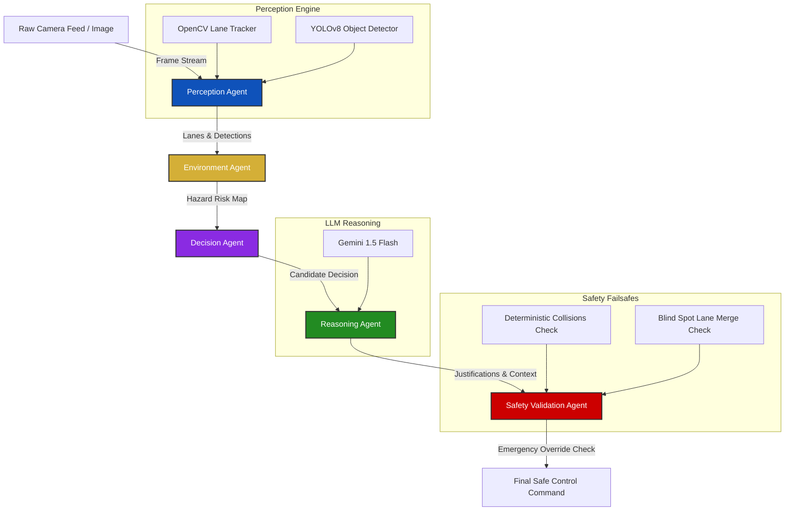

# Agentic Autonomous Driving Assistant (ADAS-Agent)

An industry-grade, multi-agent AI-powered autonomous driving assistant combining Computer Vision (YOLOv8 + OpenCV), Directed Acyclic Graph (DAG) state orchestration (LangGraph), Generative AI explainability (Gemini API), and deterministic Safety Enforcer boundaries.

---

## 🛠️ System Architecture



---

## 📂 Project Directory Structure

```text
agentic_autonomous_driving_assistant/
│
├── agents/
│   ├── __init__.py
│   ├── perception_agent.py      # Core CV pipeline (OpenCV + YOLOv8)
│   ├── environment_agent.py     # Hazard and collision risk scoring
│   ├── decision_agent.py        # Autonomous rule-based action generator
│   ├── reasoning_agent.py       # Gemini API explainability generator
│   └── safety_agent.py          # Deterministic constraint validator
│
├── configs/
│   └── settings.py              # Configurations, thresholds, and variables
│
├── utils/
│   ├── helpers.py               # Pathing and logging utilities
│   └── cv_helpers.py            # Lane detection & bounding box visualization
│
├── data/
│   └── samples/                 # High-fidelity sample images for scenarios
│
├── tests/
│   └── test_agents.py           # Verification suite
│
├── app.py                       # Streamlit UI Dashboard
├── graph.py                     # LangGraph State Machine
├── requirements.txt             # Project dependencies
└── README.md                    # This document
```

---

## 🏁 Installation & Quick Start

### Prerequisites
- Python 3.9+
- A Gemini API Key (Optional; fallback rule engine handles offline scenarios gracefully)

### Step 1: Clone and Set Up Environment
```bash
git clone https://github.com/your-username/agentic-autonomous-driving-assistant.git
cd agentic-autonomous-driving-assistant
python3 -m venv venv
source venv/bin/activate
```

### Step 2: Install Dependencies
```bash
pip install -r requirements.txt
```

### Step 3: Configure Environment Variables
Create a `.env` file in the project folder:
```env
GEMINI_API_KEY=your_actual_gemini_api_key_here
```

### Step 4: Run the Dashboard
```bash
streamlit run app.py
```
Open [http://localhost:8501](http://localhost:8501) in your browser.

---

## 🔍 Technical Deep-Dive

### 1. OpenCV Lane Detection Pipeline
The lane tracking uses a classical CV approach to segment boundary markers:
- **Pre-processing**: Grayscale conversion followed by `GaussianBlur` to filter high-frequency sensor noise.
- **Feature Extraction**: `Canny` Edge Detection identifies pixels corresponding to line markings.
- **ROI Masking**: Apply a trapezoidal mask focusing on the vehicle's driving corridor.
- **Hough Line Transform**: `HoughLinesP` clusters edge pixels into lines. Left lane marks (negative slope) and Right lane marks (positive slope) are filtered and extrapolated to project green overlay lanes.
- **Departure Estimation**: The difference between the frame center (vehicle center) and the lane polygon center is computed to throw directional alerts.

### 2. YOLOv8 Deep Learning Detector
- Object detection runs on `yolov8n.pt` to detect dynamic entities (vehicles, pedestrians) and static traffic signs (stop signs, lights).
- Distance is estimated dynamically using the inverse relationship of object height and perspective:
  $$Distance = \frac{Calibration Factor}{Bounding Box Height Fraction}$$

### 3. Agent Coordination (LangGraph)
- State transitions are coordinated as a directed sequence.
- State schema retains raw frames, OpenCV drawings, object lists, calculated hazards, and explanations.

### 4. Safety Validation (Failsafe Guard)
- Generative AI models are subject to hallucinations, latency, or API disconnects.
- To achieve industry-grade reliability, the final control command must pass a **deterministic enforcer** checking immediate constraints (proximity boundaries, blind spot occupancy) before emitting steering commands.

---

## 🧪 Verification & Testing Strategy
Run unit tests to verify agent state transitions and override correctness:
```bash
python3 -m unittest discover -s tests
```

---

## 💼 Recruiter Guide & Resume Ready Descriptions

### Resume Description (ATS-Friendly)
> **AI & Autonomous Systems Engineer**
> *Developed a multi-agent autonomous driving assistant utilizing Python, OpenCV, YOLOv8, LangGraph, and Gemini 1.5. Configured a DAG-based orchestration pipeline coordinating Perception, Environment, Decision, Reasoning, and Safety Validation agents. Engineered OpenCV lane tracking algorithms rendering departure warnings alongside YOLO-based distance estimators. Built a dual-layer decision engine securing operations via a deterministic validation layer protecting against generative model hallucinations.*

### Core Interview Explanations
1. **Why LangGraph for ADAS?**
   *By decoupling perception from planning and safety, we avoid monolithic coding. Each agent performs one task. For instance, updating safety boundaries is done in the Safety Agent without refactoring OpenCV code. Additionally, it models asynchronous processing patterns used in real-world systems (like ROS).*
   
2. **How does the system handle Gemini failures?**
   *A deterministic local fallback engine immediately generates safe justifications if the API times out or throws an error. This follows standard safety principles: control and safety actions are local, while explainability can fail gracefully without crashing the vehicle.*

---

## 🗂 Interview & Demo Resources

- **Architecture overview:** [docs/ARCHITECTURE.md](docs/ARCHITECTURE.md)
- **Interview talking points & FAQs:** [docs/INTERVIEW_TALKING_POINTS.md](docs/INTERVIEW_TALKING_POINTS.md)
- **Quick demo script:** [scripts/demo_commands.sh](scripts/demo_commands.sh)

Use the `INTERVIEW_TALKING_POINTS.md` file for short, interview-ready scripts and the architecture doc when sketching diagrams on a whiteboard.

---

## Deployment: Fixing OpenCV import errors

If you see errors like `ImportError: libGL.so.1: cannot open shared object file: No such file or directory` while deploying (common on Streamlit Cloud or minimal Docker images), add the missing system packages.

- For Streamlit Community Cloud: a `packages.txt` file is supported and will be installed during the build. This repository includes `packages.txt` with the required packages.

- For Streamlit Community Cloud: a `packages.txt` file is supported and will be installed during the build. This repository includes `packages.txt` with the required packages. If the app still fails with `libGL` errors, redeploy the app after pushing the pinned `requirements.txt` and the included `scripts/post_build.sh` (Streamlit Cloud runs `pip install -r requirements.txt` during build; the `post_build.sh` script can be executed manually in the app console to force-reinstall the headless wheel).

- For Debian/Ubuntu servers or Docker images, install:

```bash
sudo apt-get update
sudo apt-get install -y libgl1-mesa-glx libglib2.0-0
```

- Make sure the Python wheel is the headless OpenCV build (no GUI dependencies):

```bash
pip uninstall -y opencv-python opencv-python-headless
pip install --no-cache-dir --force-reinstall opencv-python-headless==4.13.0.92
```

If you're deploying to Streamlit Cloud and the build still shows `libGL` errors, open the app's "Advanced" console and run:

```bash
bash scripts/post_build.sh
```

That forces reinstallation of the pinned headless wheel in the app environment.

These steps resolve the `libGL.so.1` missing error and allow `cv2` to import successfully.
