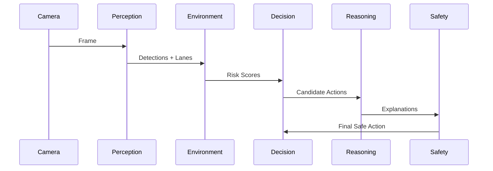

# Architecture Overview

This document summarizes the system components, responsibilities, and a concise diagram to use when explaining the project in interviews.

## Components

- Perception Agent (`agents/perception_agent.py`)
  - Runs YOLOv8 for object detection and OpenCV lane detection pipeline.
  - Outputs detections, lane polygons, and visualization overlays.

- Environment Agent (`agents/environment_agent.py`)
  - Consumes perception outputs to compute hazard maps, occupancy, and short-term risk scores.

- Decision Agent (`agents/decision_agent.py`)
  - Transforms hazard scores into ranked candidate actions (slow, steer-left, brake, maintain).
  - Produces minimal, rule-based controls when high-risk thresholds are crossed.

- Reasoning Agent (`agents/reasoning_agent.py`)
  - Uses a generative model (Gemini) to produce natural-language explanations and context for decisions.
  - Optional and runs with timeouts and fallbacks.

- Safety Agent (`agents/safety_agent.py`)
  - Deterministic enforcer that validates candidate actions against safety constraints.
  - Responsible for emergency overrides and providing audit logs for post-hoc analysis.

- Orchestration (`graph.py`)
  - Implements the LangGraph DAG for state transitions between agents and retains state between steps.

## Interview Diagram (use this verbally or paste into slides)

## Design Rationale (short bullets)

- Single Responsibility: Each agent implements a single capability for easier testing and replacement.
- Deterministic Safety: Final actuator commands must pass deterministic checks to prevent LLM hallucination from causing unsafe control.
- Explainability: Separating the reasoning chain enables natural-language justification without coupling it to the control pipeline.
- Incremental Deployment: The pipeline supports toggling the Reasoning Agent (Gemini) for offline or privacy-sensitive deployments.

## How to present in an interview

- Start with the high-level flow (Perception -> Environment -> Decision -> Safety -> Actuation).
- Emphasize the safety layer and fallback mechanisms for the LLM.
- Discuss tradeoffs: explainability vs. latency, model size vs. accuracy, and real-time constraints.

